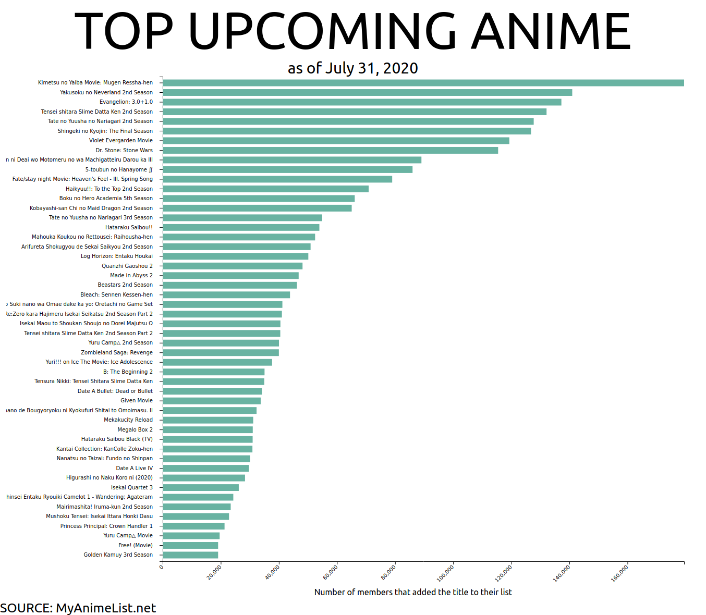

# Applying React with D3 and APIs

This project was made using React with Javascript and D3.js gathering data from the unofficial API from MyAnimeList.net "Jikan" to show the top upcoming anime.

## Credits
The code I used to create the horizontal bar chart was adapted from:

- https://bl.ocks.org/hrecht/f84012ee860cb4da66331f18d588eee3
- https://www.d3-graph-gallery.com/graph/barplot_horizontal.html
- http://www.cagrimmett.com/til/2016/04/26/responsive-d3-bar-chart.html
- Jikan: https://jikan.moe/
